# Deliverable 2

## Question 1

## Question 2

## Question 3
`hostname -I` is used to display the IP address 

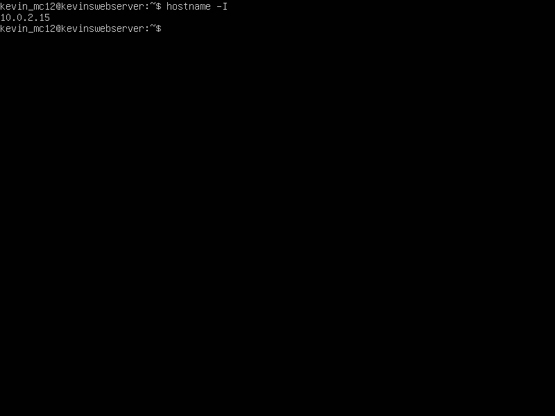

## Question 4
`sudo ufw enable` is used to enable the Ubuntu firewall

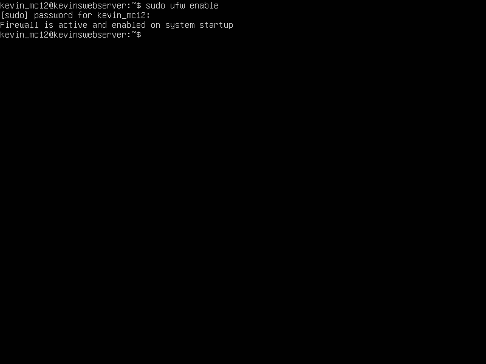

## Question 5
`sudo ufw status` checks if the Ubuntu firewall is running

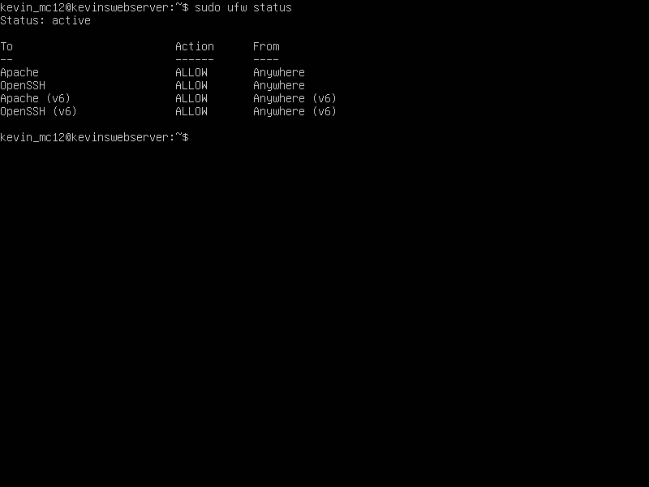

## Question 6
`sudo ufw disable` disables the Ubuntu firewall

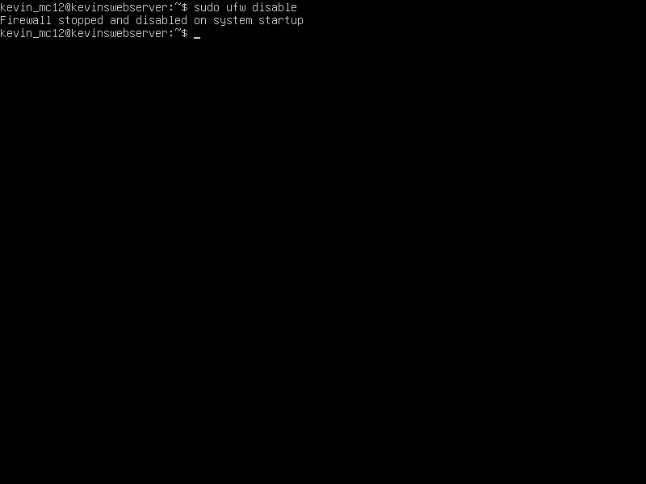

## Question 7
`sudo ufw allow 'Apache'` adds Apache to the firewall

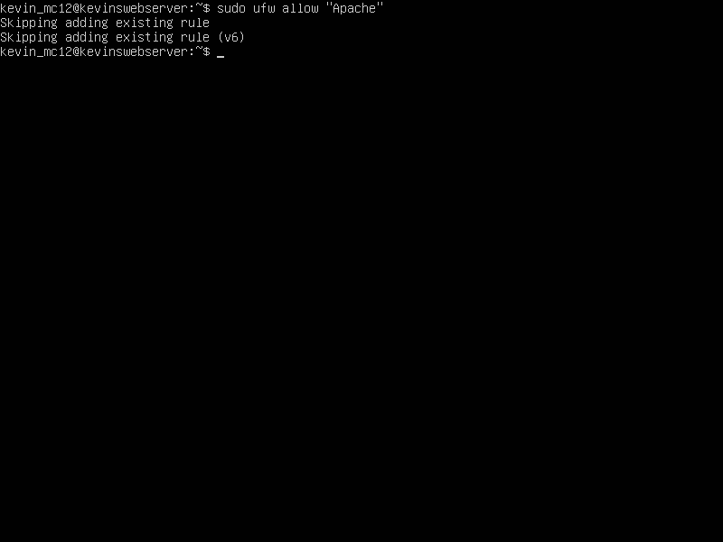
(Apache is already added to the firewall for me)
## Question 8
`sudo apt install apache2` installs Apache 

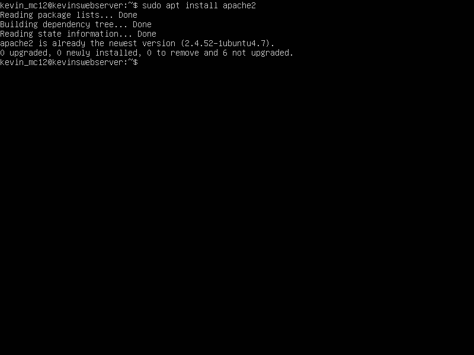
(Apache is already downloaded for me)

## Question 9
`sudo systemctl status apache2` checks if Apache is running

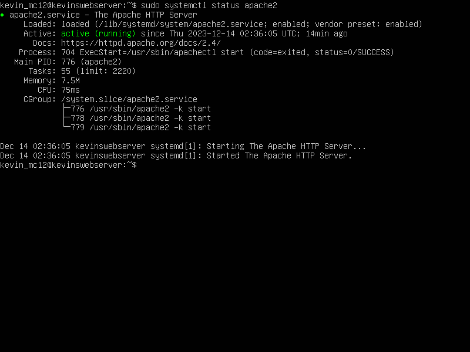

## Question 10
`sudo systemctl stop apache2` stops Apache

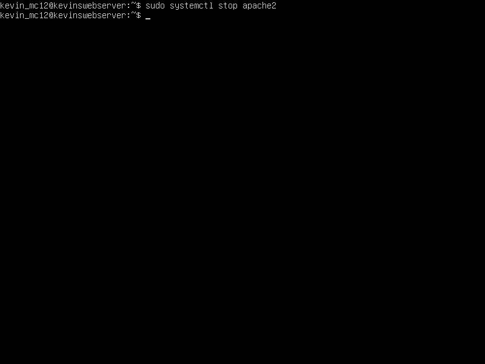

## Question 11
`sudo systemctl restart apache2` restarts Apache

## Question 12
`sudo apachectl -t` tests Apache configuration

## Question 13
`sudo apache2 -v` checks the installed version of Apache

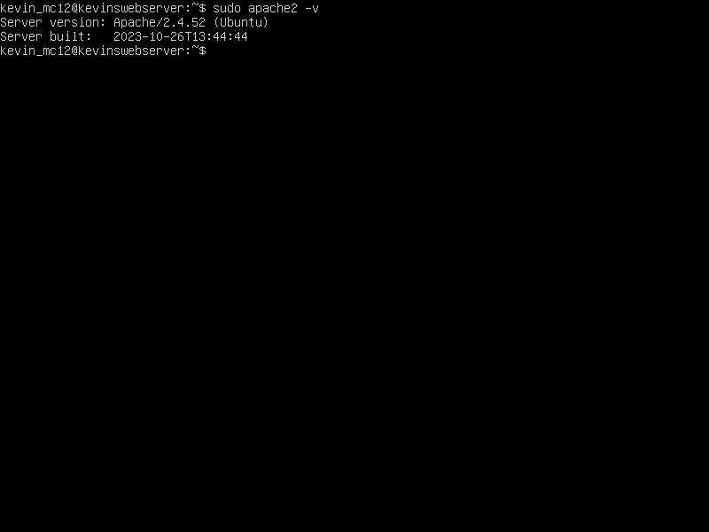

## Question 14
**Most Common Apache Commands for Troubleshooting**

`systemctl` is used to control and interact with Linux services with the `systemd` service manager.

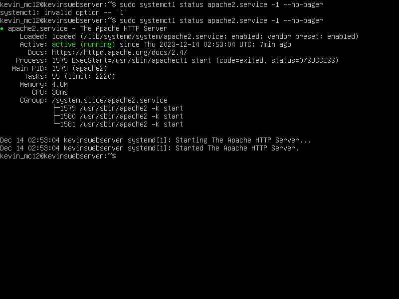

`journalctl` is used to query and see the logs generated by `systemd`

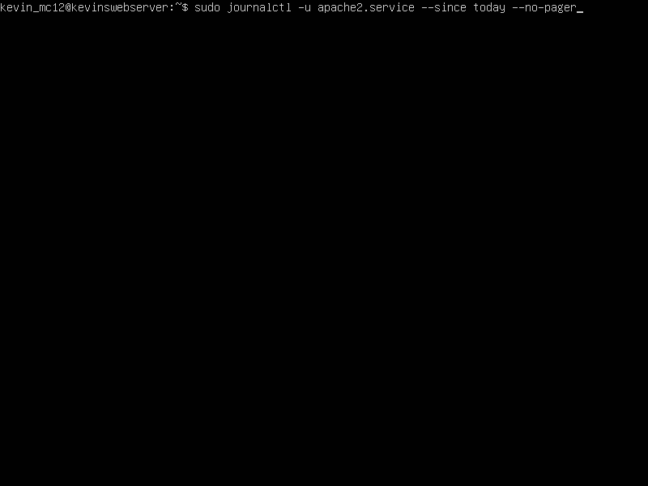
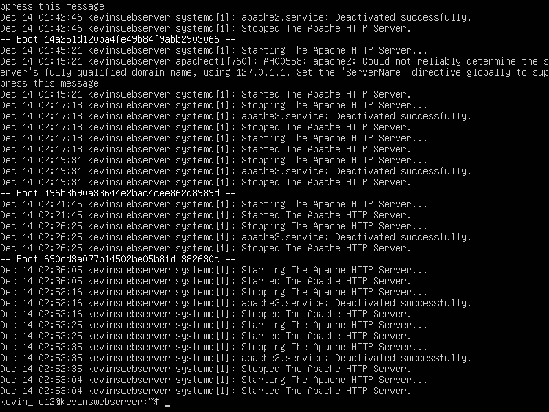

`apachectl` is used to check Apache's configuration, which is helpful for troubleshooting

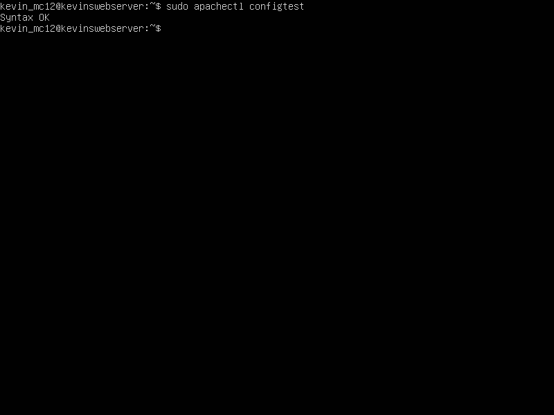

## Question 15
Apache log files are files that show the events handled by the Apache web server. These files are used for troubleshooting errors that a user receives in a browser or another HTTP client. 

**Example:** 
Looking for the last 10 lines in the Apache error log to help with troubleshooting: 
`sudo tail -n 10 /var/log/apache2/error.log`

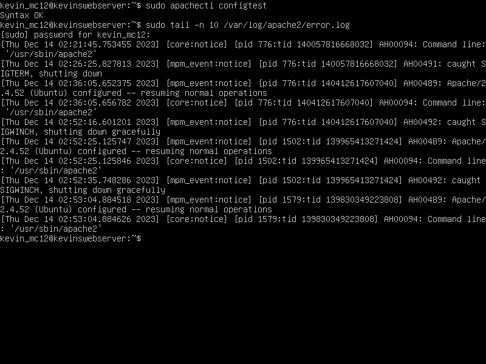
