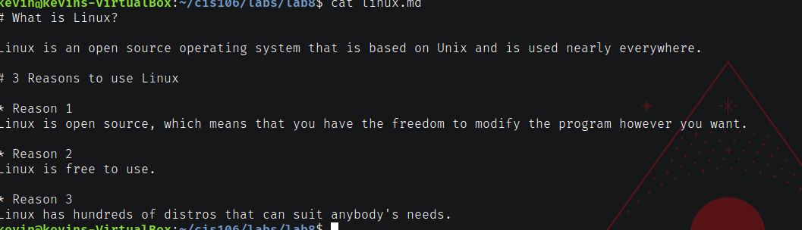
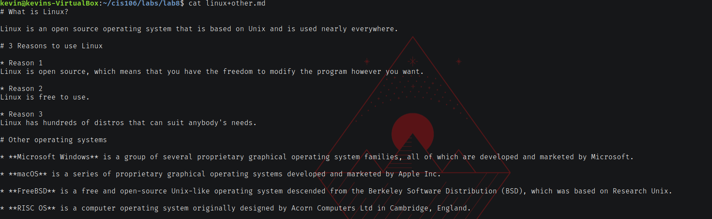
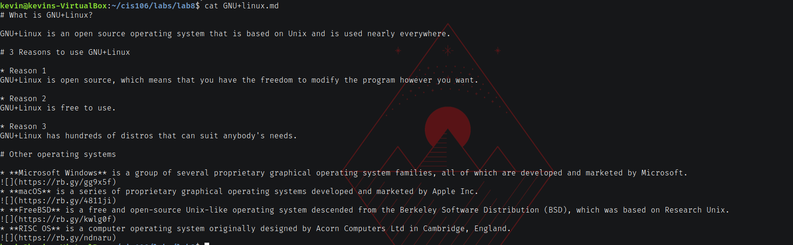

# Lab 8

## URLs of the md files

linux.md : https://github.com/KevinMC12/cis106/blob/main/cis106/labs/lab8/linux.md

linux+other.md : https://github.com/KevinMC12/cis106/blob/main/cis106/labs/lab8/linux%2Bother.md

GNU+linux.md : https://github.com/KevinMC12/cis106/blob/main/cis106/labs/lab8/GNU%2Blinux.md

## Screenshots

