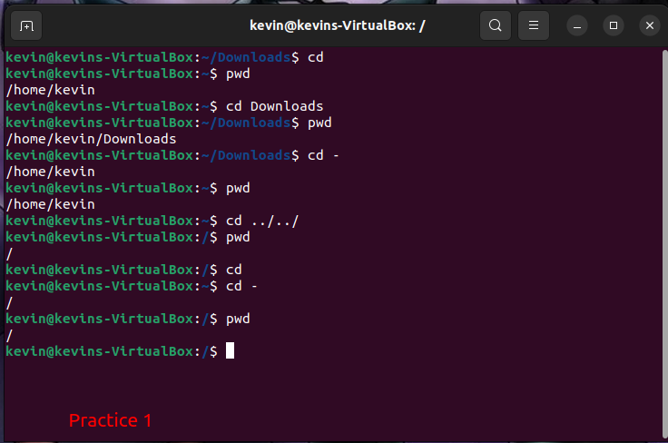
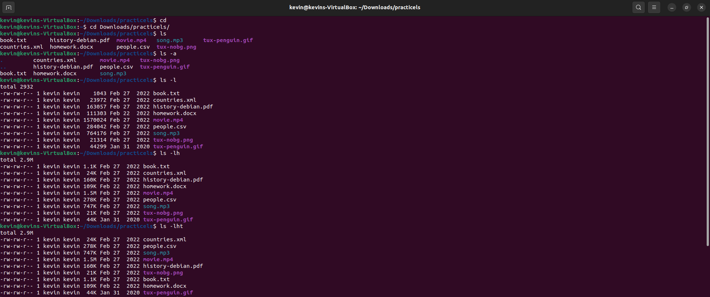
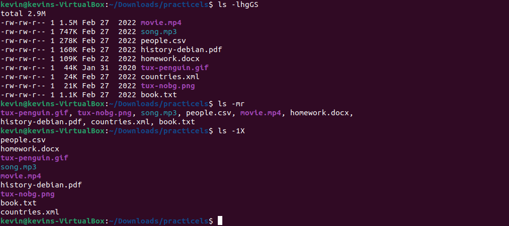
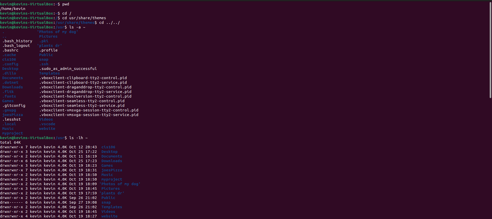
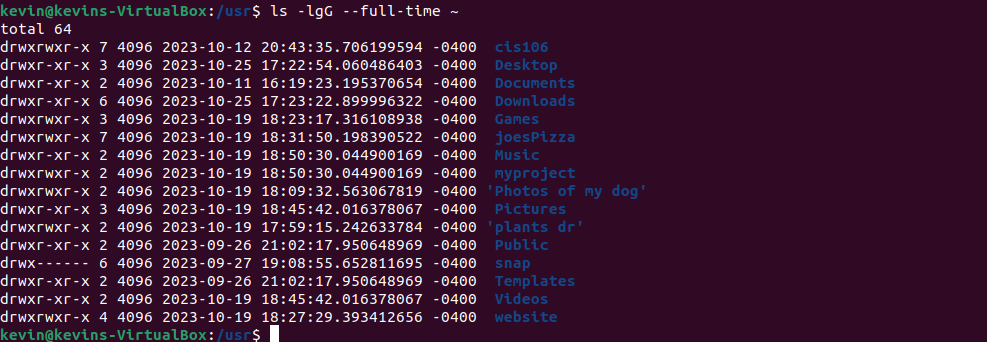
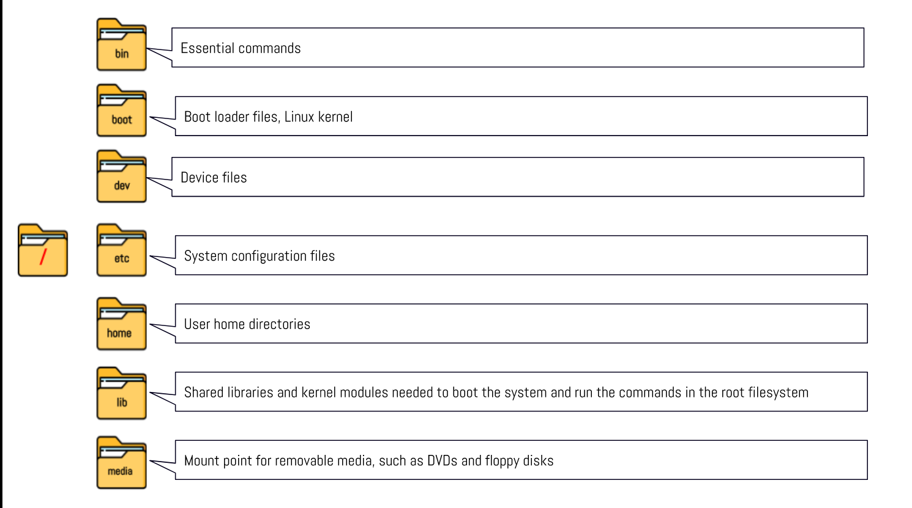
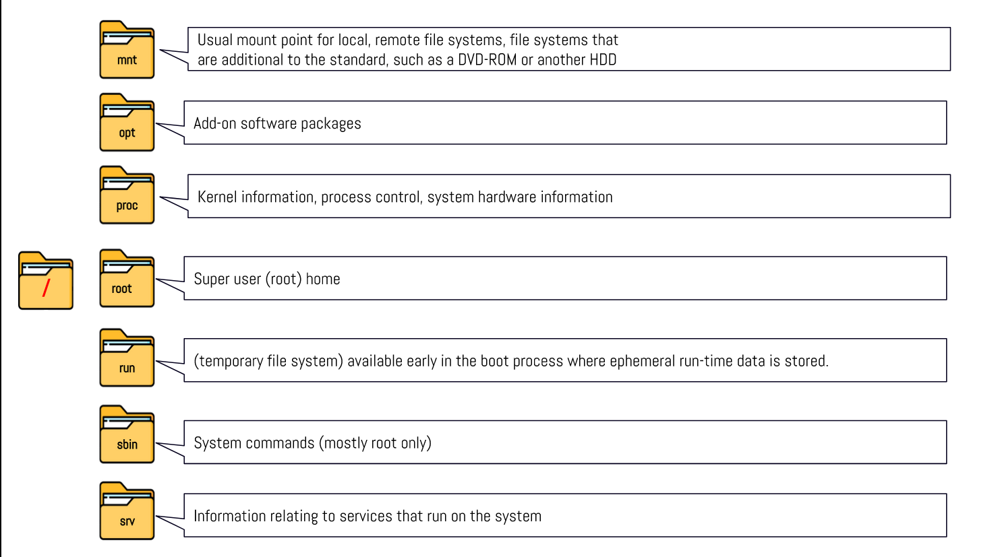
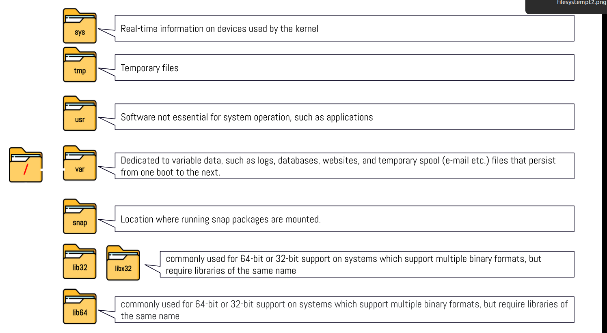

# Week Report 4

## Practice Questions
### Practice 1

### Practice 2

### Challenge Practice

## Linux File Directories and Their Purpose

## All the Commands For Navigating the Filesystem

| command | what it does                                                                                             | syntax             | example         |
| ------- | -------------------------------------------------------------------------------------------------------- | ------------------ | --------------- |
| pwd     | Displays the current working directory                                                                   | `pwd`              | `pwd`           |
| cd      | Changes the current working directory. The home directory is chosen if there is no directory given       | `cd` + `directory` | `cd Downloads/` |
| ls      | Displays all files in a chosen directory. The current directory is chosen if there is no directory given | `ls` + `option` + `directory to list`| `ls` `-a` `Downloads/` |

## Basic Terminology

* **filesystem-** The way files are created and organized

* **current directory-** The directory you are at in the moment

* **parent directory-** A particular directory in which you can move forward to a subdirectory or backwards to a previous directory

* **the difference between *your* home directory and *the* home directory-** *Your* home directory refers to your user's home directory while *the* home directory refers to the home directory located in the root. 

* **pathname-** The indication of the location of a file in the filesystem

* **relative path-** The location of a file starting from the current directory or a directory that is located inside the current directory

* **absolute path-** The location of a file starting at the root of the file system