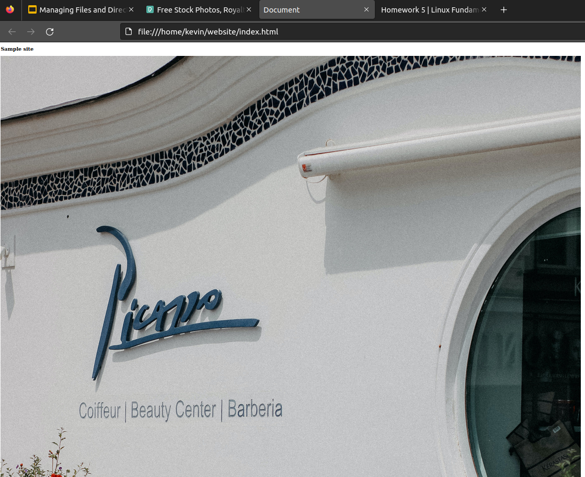
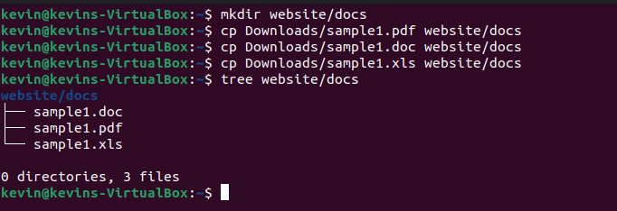

---
Name: Kevin Marcelo-Castillo
Course: cis106
Semester: Fall 2023
---
# Questions
**What are Command Options?**
Command options are commands followed by options that modify/enhance their behavior.

**What are Command Arguments?**
Command arguments are commands followed by arguments, which are the items the command acts on. This can be a file or directory.

**Which command is used for creating directories?**
`mkdir` is the command used for creating directories. The syntax is `mkdir` + `name of the directory`
***Examples***: `mkdir weekreport5`, `mkdir ~/Pictures/PicturesOfMyDog`, `mkdir Games`

**What does the touch command do?**
The `touch` command is used for creating files.
***Examples***: `touch list`, `touch darksouls.py monsterhunterworld.txt gta5.png`, `touch ~/Downloads/MathHomework.txt`

**How do you remove a file?**
The `rm` command is used for removing files.
***Example***: `rm list` 

**How do you remove a directory and can you remove non-empty directories in Linux?**
`rmdir` is the command used for removing directories. You cannot remove non-empty directories in Linux.
***Example***: `rmdir Games`

**Explain the mv and cp command**
The `mv` command moves and renames directories. The formula for moving directories is `mv` command is `mv` + `source` + `destination`. The formula for renaming directories is `mv` + `file/directory to rename` + `new name`. 
***Examples***: `mv Downloads/homework.txt Documents/`, `mv darksouls.py bloodborne.py`

The `cp` command copies files/directories from a source to a destination. The formula for `cp` is `cp` + `files to copy` + `destination`. Use `cp -r` to copy directories.
***Examples***: `cp Downloads/wallpapers.zip Pictures/`, `cp -r ~/Downloads/wallpapers ~/Pictures/`

# Practice

### Practice 1 

### Practice 2

### Practice 3

### Practice 4

