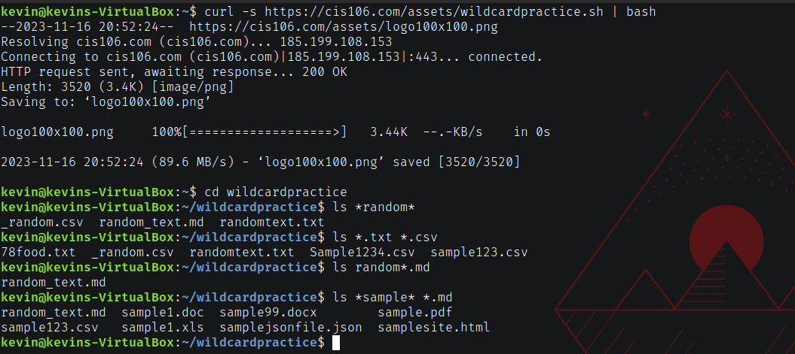
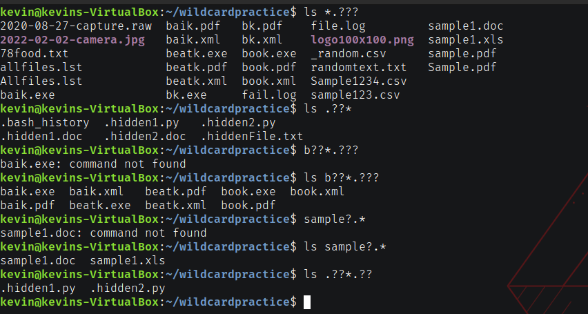
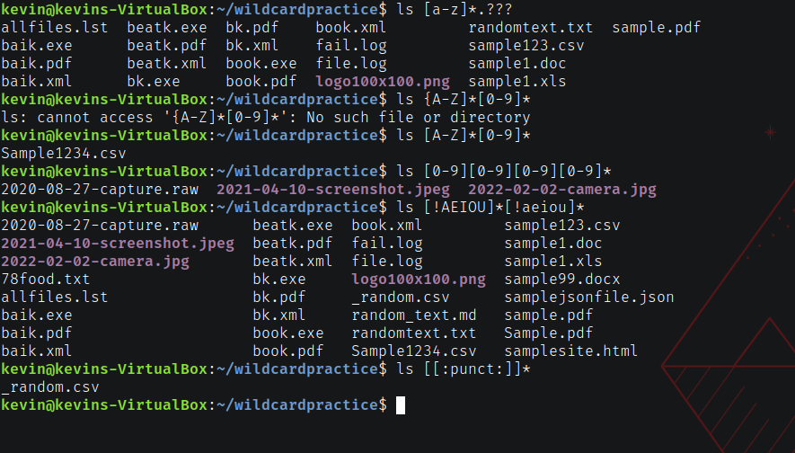

# Week Report 6

## Wildcards
**The `*` wildcard:** The star alone matches anything and nothing and matches any number of characters. 

***Examples*** 
To list all files with .txt: `ls *.txt`
To move all files containing .txt to the Documents directory: `mv *.txt Documents`
To list all files in the Documents directory containing the word "games": `ls ~/Documents/*games*`

**The `?` wildcard:** Matches precisely one character.

***Examples***
To list all hidden files: `ls .??*`
To list all files that have a three-letter file extension: `ls *.???`
To list all files that have two characters between letter g and s: `ls g??s* `

**The `[]` wildcard:** Matches a character in range. The exclamation point reverses the match.

***Examples***
To match all files that contain a vowel after the letter s: `ls s[aeiou]*`
To match all files that do not contain a vowel after the letter s: `ls s[!aeiou]*`
To match all files whose name has at least one number: `ls *[0-9]*`

## Brace Expansion
Brace expansion is another feature of bash that lets you create arbitrary strings to use with commands.

***Examples***
To make a whole directory structure in a single command: `mkdir -p games/{shooter,rpg} music/{rock,lo-fi} pictures/{photos-of-my-dog,family}`
To create a certain number of files: `touch food{1..4}.png`
To remove multiple files in a directory: `rm -r {games,music,pictures,docs.docx,words.txt}`
## Practice 5

## Practice 6

## Practice 7
